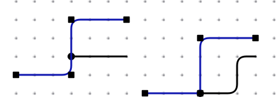
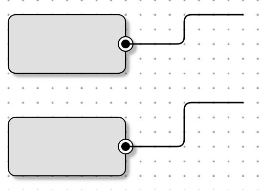
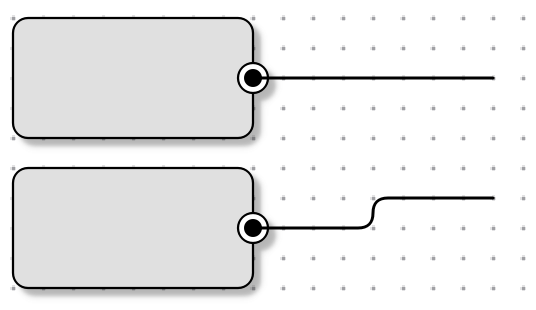
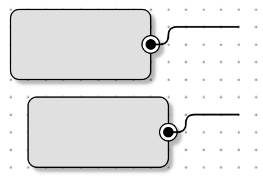
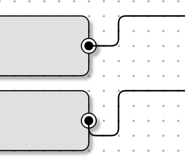
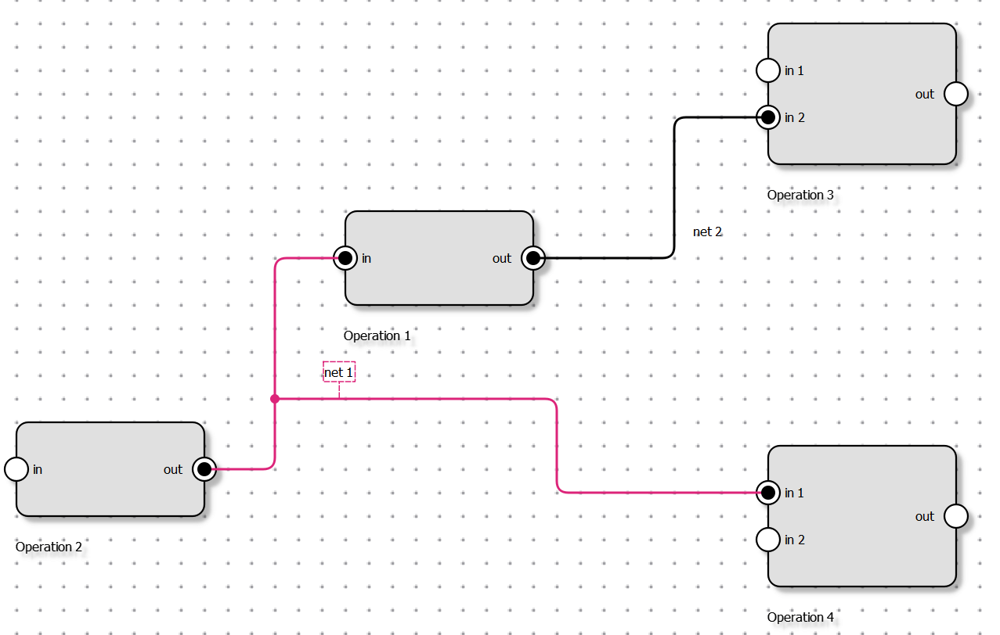

# Top-Level Items

When adding an `Item` to the `Scene`, there are two possibilities. If the
`Item` is a "Top-Level" Item (it has no parent), then you should use
`Scene::addItem()`. If the `Item` is the child of another `Item` then you need
to use the superclass' implementation `QGraphicsItem::addItem()`.

> This is needed to determine which Items should be moved by the scene and
> which are moved by their parent

# Wire System

The logic related to the wires is implemented in the `wire_system` directory.
The classes in the wire system are all in the `wire_system` namespace. The Wire
System is compiled as it's own CMake target and includes unit-tests.

## Manager

The most important class in the wire system is the `wire_system::manager`.
This is the class that registers the wires, handles the nets and connections to
connectable items like the `QSchematic::Connector`.

## Wire

The `wire_system::wire` class contains a list of `wire_system::point`, that
represent the points of the wire.

### Moving a wire

When a wire moves, there are a lot of things that have to be taken into
account.  The junctions have to stay on the wire and the points that are
attached to connectables have to stay on them. What makes this complicated is
the fact that multiple items can be moved at the same time, which in some cases
won't result in the same thing as if there were moved individually. This is
especially tricky as the items won't always move in the same order.

#### Connectables

When a wire is moved, it has to stay connected to the `connectables`. This is
done by moving the attached points in the opposite direction the wire is
moving.

This is implemented in `Wire::itemChange()` when `change` is
`ItemPositionHasChanged`. It is important, that this is only done when the
connector isn't moving, because if it is, the connector will call the manager's
`connector_moved()` method and this leads to problems in some situations.

This should ideally be done in the `wire_system::wire` but as that makes it
impossible to know if the connector will move, this hasn't been done yet.

#### Junctions

When a wire moves, it has to carefully move it's own junctions and the junction
of the other wires that are on it. This is implemented in the
`wire_system::wire` class in `void wire::move(const QVector2D& movedBy)`. This
moves every point in the direction of `movedBy` and makes sure that all the
junctions move to the correct place.

First the wire moves every of its own junctions in the opposite way it is
moving so that the junction will stay at the same position they were. Then it
goes through all the junctions that are attached to it and moves them in the
direction it is moving.

This causes some problems when the junction's new position is the same as one
of the wire's current points because then when moving the points, the point on
which the junction now is will move it, which results in the junction being
moved twice. The image below, shows how this looks.  The left part is the
initial position, and the right one is what results if the selected wire is
moved down by one.  As you can see, the second wire wasn't moved as expected
because it was moved from the segment onto the point before the wires was
moved.  

### Moving a point

There are two ways of moving the point of a wire: `wire::move_point_by()` and
`wire::move_point_to()`. The first one moves a point relative to it's position
and the other moves it to a absolute position on the scene. This is not the
only difference though, the first one will take care of some additional stuff
like making sure that right angles are preserved if this is expected. The
second one, `wire::move_point_to()`, only moves the point to a position without
worrying about anything else.`move_point_by()` is primarily used when a
connectable moves and when moving junctions that are on wires. When the user
moves a point, `move_point_to()` is used.

> Try to never use `QList::indexOf()` to get the index of a point because there
> might be multiple points at the same position.

#### Move By

When moving a point with `move_point_by()`, there are a few additional things
that have to be taken into account.

##### 90deg Angles

If `QSchematic::Settings::preserveStraightAngles` is enabled, we have to make
sure that when a point is moved, the right angles are preserved. For example,
in the screenshot below, the node was moved down by 1. This resulted in both
the first and second point of the wire to move down so that the angles are
preserved.

If the wire only has two points and one of the points is moved perpendicularly
to the line connecting both points, the wire has to be cut in half and a new,
perpendicular segment has to be added.

##### Avoiding collisions

When a points is moved in a way that would make it collide with a segment, that
segment has to be moved away.

##### Junctions

When a point is moved, the junctions that lay on the adjacent segments have to
be moved with the segments. For example, in the screenshot below, the node was
moved up by one which resulted in the junction being moved up with the segment.

##### Adding segments

When a segment that is attached to another wire or a connector is moved, a new
segment is added between the end of the segment and where it was attached. In
the example below, the segment attached to the connector was moved down by one.

#### Point move command

When a point is moved by the user a `CommandWirepointMove` command is created
on the undo stack. The command stores the location of the points before and
after the move.

### Junctions

When one of the wires extremities (first or last point) is moved onto another
wire it becomes a junction.

When a point is moved, the `wire_system::manager::point_moved_by_user` method
is called. If the point is moved onto another wire, it then calls
`wire_system::manager::connect_wire()` to connect the two wires. This calls
`wire::connect_wire()` of the onto which the other was moved on, merges the
nets of the two wires and sets to point to be a junction.
`wire_system::manager::connect_wire()` is also used in `QSchematic::Scene` in
`mouseDoubleClickEvent()` and `mousePressEvent()` while creating a new wire.

#### Updating junctions

When moving a point or segment we have to move all the junctions that are on a
part of the wire that is changing.

In `wire::move_point_by()` we move the junctions that are on the next and
previous segment but only if the segment is horizontal or vertical. If it's
not, it will be taken care of by `wire::move_point_to()`.

In `Wire::move_line_segment_by()` we move the junctions that are on segments.

In `Wire::move_point_to()` we move the junctions that are on the point we are
moving and those that are on the segments attached to the point. This is done
in `move_junctions_to_new_segment()`. This takes two segments, the current
segment and the segment as it will be after the point moved, and move all the
junctions that are on the first segment to the second segment.

### QSchematic::Wire

The `wire_system::wire` class only implements the logic that is related to the
wire. For the graphical stuff, `QSchematic` uses a subclass named
`QSchematic::Wire`. This class also inherits from `QSchematic::Item` and takes
care of rendering the wire and handles the events like when the user drags a
point etc. As the wire has to be redrawn when the points are modified, the
`wire_system::wire` class provides two virtual methods, `about_to_change()` and
`has_changed()` that the `Wire` overrides to do what is necessary.

## Connectable

A wire can be attached to a `wire_system::connectable`. `connectable` is just a
simple interface with a single method `position()` that returns the position of
the item. For example, `QSchematic::Connector` implements this interface to
make it possible for wires to attach to them.

### Connections

The connections between `wire` and `connectable` are stored in the
`manager::m_connections` as a `QMap<const connectable*, QPair<wire*, int>>`.
This store the `connectable`, the `wire` and the index of the point in the
wire.

It's important that the indexes in the map are always up to date, even when a
point is inserted into or removed from the wire. For this reason, the `manager`
implements two functions `point_inserted(const wire*, int)` and
`point_removed(const wire*, int)` that are called from the wire when this
happens, so that the indexes can be updated.

### Attaching a point to a connector

When the extremity of a wire is moved onto a connectable, it gets attached to
it.  The logic is implemented in
`wire_system::manager::attach_wire_to_connector()`. There are quite a few
places this has to be used.

The most straightforward being in `QSchematic::wirePointMoved()`. This gets
called whenever a point is moved by the user, that means, the point is moved
directly, not because something else made the point move. In there we have to
iterate over all the connectors and check if the point that is being moved is
on one of them and attach it if it's the case.

Another way to have a point on a connector without moving a point is while
creating a new wire. To attaching the points while creating a wire,
`Scene::mousePressEvent()` also makes sure that new points get attached to the
connectors. If a point, that is not the first point is attached, the wire is
terminated.

When loading a file, all the connections have to be generated from the position
of the wires and the connectors. This is done in`Scene::generateConnections()`.

It is also possible to connect a connector to a point by moving it onto the
point. This is done in `Scene::mouseReleaseEvent()` by calling
`updateNodeConnections()`.

### Detaching a point from a connector

When a point is moved , `Scene::wirePointMoved()` automatically detaches the
point from a connector, if it's connected, regardless of whether it is still on
the connector or not. Then it checks if there is a connector at the point's
position and attaches it to that connector if there is one.

When a wire is removed, `Scene::removeWire()` detaches the wire from all the
connectors it is attached to.

### Moving a connectable

When a connectable moves, `manager::connector_moved()` has to be used to notify
the manager so that it can make sure the wires stay connected to it.

### Connectors

`QSchematic` uses a subclass of `connectable` called `Connector` that inherits
from `QSchematic::Item` and implements everything that relates to the graphics.

## Net

Every wire is part of a net and a net can contains multiple wires.

### Moving a point

When a point is moved away or onto another wire they have to be connected or
disconnected accordingly. As previously mentioned, this is done in
`manager::connect_wire()` and `manager::disconnect_wire()`.

#### Connecting wires

When `connet_wire()` is called, it merges the nets of the two wires by calling
`manager::merge_nets()`, which moves the wires from the second net into the
first net and the deletes the unused net.

#### Disconnecting wires

When disconnecting wires, it's a bit more complicated. The
`manager::disconnect_wire()` function disconnects a wire (w2) from another wire
(w1). It first calls `w1->disconnectWire(w2)` so that w1 no longer considers w2
as being connected to it. Then, it calls `manager::wires_connected_to(w1)` to
get a list of all the wires that are connected to w1 or that w1 is connected
to. If there are wires in the net that are not in that list, a new net has to
be created and those wires must be moved to it. This makes sure that if the
wire that is being disconnected is still part of the same net, it will stay in
it.

It's important that if w1 is connected to w2, it has stay connected so that the
wires can be restored correctly.

### Adding a wire

Every wire has a name. When a new wire is added by using a, a new net is
created for it.  As this is done using a `CommandItemAdd`, we also have to deal
with what happens, if the command is undone and redone. And because the name
has to be maintained, we can't simply delete the net when the command is undone
and create a new one when it is redone, but instead we keep the net alive by
storing a `shared_ptr` to the net in the wire. When `CommandItemAdd::redo()` is
called it checks if the wire has a previous net stored in `wire::net()`. If
there is already one, it makes sure that it's in the scene and adds the wire to
it. If it has no previous net, a new net has to be created calling
`manager::add_wire()`.

#### Undoing

When the command is undone, it simply calls `manager::remove_wire()`. This will
remove the net from the manager's list if this was the last wire in it, but it
won't delete it.

### Removing a wire

When a wire is removed by a `CommandItemRemove`, `Scene::removeWire()` is
called. This removes the wire from the scene, detaches it from every connector
and the calls `manager::remove_wire()` which disconnects it from all the wires
it is attached to, removes it from its net and removes the net from the scene
if it was the last wire in it. The wire keeps a `shared_ptr` to the net, so
that if the command is undone, it can be added to the same net.

#### Undoing

When the wire is added back to the scene, we retrieve the net is was originally
in and if it's no longer registered with the `manager` we use `add_net()` to
add it back before adding the wire to the net.

### QSchematic::WireNet

`QSchematic` uses a subclass of `net` called `WireNet`. This subclass
implements the graphical behaviors of the net, like the highlighting and label
that shows the name. As the nets are created by the `manager`, the `manager`
provides a `manager::set_net_factory()` method that takes a
`std::function<std::shared_ptr<net>()>` as parameter, that will be used when
creating new nets.
